Markdown documentation created by [pyLODE](http://github.com/rdflib/pyLODE) 2.4

# Extension for document types for the ISO 21597 ICDD Part 1 Container ontology

## Metadata
* **IRI**
  * `https://w3id.org/exdoc`
* **Publisher(s)**
  * [Chair of Computing in Engineering](http://www.inf.bi.rub.de)
* **Creators(s)**
  * [Philipp Hagedorn](https://orcid.org/0000-0002-6249-243X)
    [[ORCID]](https://orcid.org/0000-0002-6249-243X)
    (<philipp.hagedorn-n6v@rub.de></a>) of [Ruhr-Universitaet Bochum](https://www.inf.bi.ruhr-uni-bochum.de/iib/lehrstuhl/mitarbeiter/philipp_hagedorn.html.en)
* **Modified**
  * 2023-05-25
* **Issued**
  * 2021-05-08
* **Version Information**
  * v0.5
* **License &amp; Rights**
  * [https://creativecommons.org/licenses/by/4.0/](https://creativecommons.org/licenses/by/4.0/)
  * &copy; 2023 by Chair of Computing in Engineering, Ruhr University Bochum
* **Source**
  * [https://github.com/RUB-Informatik-im-Bauwesen/exdoc](https://github.com/RUB-Informatik-im-Bauwesen/exdoc)
* **Ontology RDF**
  * RDF ([docs/ExtendedDocument.ttl](turtle))
### Description

This ontology provides an extension for document types for the <a href="https://www.iso.org/standard/74389.html">ISO 21597 ICDD Part 1</a>  Container ontology <code>ct: &lt;</code><a href="https://standards.iso.org/iso/21597/-1/ed-1/en/Container.rdf">https://standards.iso.org/iso/21597/-1/ed-1/en/Container#</a><code>&gt;</code>.

The preferred namespace prefix is <code>exdoc</code> for the namespace IRI <a href="https://w3id.org/exdoc">https://w3id.org/exdoc</a>. 

It  includes the <a href="#PayloadProxy">PayloadProxy</a> class as a subclass of the <code>ct:ExternalDocument</code> class for registering payload triples from the "payload triples" folder. Instances of these classes can be used to define link elements for RDF-based data in ICDD containers.
It also includes the <a href="#ExternalRelationalDatabase">ExternalRelationalDatabase</a> and <a href="#ExternalInfluxDatabase">ExternalInfluxDatabase</a> classes as a subclasses of the <code>ct:ExternalDocument</code>. The <a href="#ExternalRelationalDatabase">ExternalRelationalDatabase</a> class can be used to provide information and connection details from an existing relational database, e.g., to retrieve data from DB and convert it into payload triples using R2RML mappings (see <a href="https://www.w3.org/TR/r2rml/">W3C R2RML Recommendation</a>). When working with databases in ICDD container, be sure you do not store credentials for the database in the connection string but in a secure credentials store. The <a href="#ExternalInfluxDatabase">ExternalInfluxDatabase</a> is used to retrieve time-series data from an InfluxDB instance.

* **History Note:** 
v0.5: added <code>ExternalInfluxDatabase</code> class

v0.4: added <code>PayloadProxy</code> class

v0.3: added <code>databaseMapping</code> reference

v0.2: added <code>databaseType</code> and <code>databaseQueryLanguage</code>

v0.1: initial ontology

## Table of Contents
1. [Classes](#classes)
1. [Object Properties](#objectproperties)
1. [Datatype Properties](#datatypeproperties)
1. [Namespaces](#namespaces)
1. [Legend](#legend)

## Overview

**Figure 1:** Ontology overview
## Classes
[External Influx Database](#ExternalInfluxDatabase),
[External Relational Database](#ExternalRelationalDatabase),
[Payload Proxy](#PayloadProxy),
### External Influx Database
Property | Value
--- | ---
IRI | `https://w3id.org/exdoc#ExternalInfluxDatabase`
Description | 
a proxy document referencing to an external InfluxDB instance

Super-classes |[https://standards.iso.org/iso/21597/-1/ed-1/en/Container#ExternalDocument](https://standards.iso.org/iso/21597/-1/ed-1/en/Container#ExternalDocument) (c) 
Restrictions |[exdoc:influxOrganisation](influxorganisation) (dp) **exactly** 1 [exdoc:influxBucket](influxbucket) (dp) **exactly** 1 [exdoc:influxSensorTag](influxsensortag) (dp) **exactly** 1 [exdoc:influxServer](influxserver) (dp) **exactly** 1 [exdoc:influxMeasurement](influxmeasurement) (dp) **min** 1 
In domain of |[exdoc:influxOrganisation](influxorganisation) (dp) [exdoc:influxBucket](influxbucket) (dp) [exdoc:influxMeasurement](influxmeasurement) (dp) [exdoc:influxSensorTag](influxsensortag) (dp) [exdoc:influxServer](influxserver) (dp) 
### External Relational Database
Property | Value
--- | ---
IRI | `https://w3id.org/exdoc#ExternalRelationalDatabase`
Description | 
a proxy document referencing to an external data source with a connection string

Super-classes |[https://standards.iso.org/iso/21597/-1/ed-1/en/Container#ExternalDocument](https://standards.iso.org/iso/21597/-1/ed-1/en/Container#ExternalDocument) (c) 
Restrictions |[exdoc:databaseName](databasename) (dp) **exactly** 1 [exdoc:databaseMapping](databasemapping) (op) **max** 1 [exdoc:databaseConnectionString](connectionstring) (dp) **exactly** 1 [exdoc:databaseQueryLanguage](querylanguage) (dp) **exactly** 1 [exdoc:databaseType](databasetype) (dp) **exactly** 1 
In domain of |[exdoc:databaseQueryLanguage](querylanguage) (dp) [exdoc:databaseMapping](databasemapping) (op) [exdoc:databaseType](databasetype) (dp) [exdoc:databaseConnectionString](connectionstring) (dp) [exdoc:databaseName](databasename) (dp) 
### Payload Proxy
Property | Value
--- | ---
IRI | `https://w3id.org/exdoc#PayloadProxy`
Description | 
a proxy document referencing to payload triples using the base uri of the triples file

Super-classes |[https://standards.iso.org/iso/21597/-1/ed-1/en/Container#ExternalDocument](https://standards.iso.org/iso/21597/-1/ed-1/en/Container#ExternalDocument) (c) 
Restrictions |[https://standards.iso.org/iso/21597/-1/ed-1/en/Container#url](https://standards.iso.org/iso/21597/-1/ed-1/en/Container#url) **exactly** 1 

## Object Properties
[database mapping](#databasemapping),

### database mapping
Property | Value
--- | ---
IRI | `https://w3id.org/exdoc#databaseMapping`
Description | The mapping file, which allows for the generation of structured RDF-based data from the specified database. This file also needs to be specified within the respective container.
Domain(s) |[exdoc:ExternalRelationalDatabase](ExternalRelationalDatabase) (c) 
Range(s) |[https://standards.iso.org/iso/21597/-1/ed-1/en/Container#Document](https://standards.iso.org/iso/21597/-1/ed-1/en/Container#Document) (c) 

## Datatype Properties
[connection string](#connectionstring),
[database name](#databasename),
[query language](#querylanguage),
[database type](#databasetype),
[influx bucket](#influxbucket),
[influx measurement](#influxmeasurement),
[influx organisation](#influxorganisation),
[influx sensor tag](#influxsensortag),
[influx server](#influxserver),

### connection string
Property | Value
--- | ---
IRI | `https://w3id.org/exdoc#databaseConnectionString`
Description | A database connection string is a string that specifies information about a data source and the means of connecting to it from an ICDD. It can be passed to an underlying driver or provider in order to initiate the connection. Warning: The connection string holds sensitive information.
Domain(s) |[exdoc:ExternalRelationalDatabase](ExternalRelationalDatabase) (c) 
Range(s) |[xsd:string](http://www.w3.org/2001/XMLSchema#string) (c) 

### database name
Property | Value
--- | ---
IRI | `https://w3id.org/exdoc#databaseName`
Description | The database name is used to adress the correct mapping from the mapping file to a certain database within the connection string.
Super-properties |[https://standards.iso.org/iso/21597/-1/ed-1/en/Container#name](https://standards.iso.org/iso/21597/-1/ed-1/en/Container#name) 
Domain(s) |[exdoc:ExternalRelationalDatabase](ExternalRelationalDatabase) (c) 
Range(s) |[xsd:string](http://www.w3.org/2001/XMLSchema#string) (c) 

### query language
Property | Value
--- | ---
IRI | `https://w3id.org/exdoc#databaseQueryLanguage`
Description | The query language, which can be used to retrieve information from the specified database.
Domain(s) |[exdoc:ExternalRelationalDatabase](ExternalRelationalDatabase) (c) 
Range(s) |[xsd:string](http://www.w3.org/2001/XMLSchema#string) (c) 

### database type
Property | Value
--- | ---
IRI | `https://w3id.org/exdoc#databaseType`
Description | The type of database that is specified, e.g. MySQL, NoSQL, and others.
Domain(s) |[exdoc:ExternalRelationalDatabase](ExternalRelationalDatabase) (c) 
Range(s) |[xsd:string](http://www.w3.org/2001/XMLSchema#string) (c) 

### influx bucket
Property | Value
--- | ---
IRI | `https://w3id.org/exdoc#influxBucket`
Description | The InfluxDB bucket.
Domain(s) |[exdoc:ExternalInfluxDatabase](ExternalInfluxDatabase) (c) 
Range(s) |[xsd:string](http://www.w3.org/2001/XMLSchema#string) (c) 

### influx measurement
Property | Value
--- | ---
IRI | `https://w3id.org/exdoc#influxMeasurement`
Description | The InfluxDB measurement filter, e.g., temperature, humidity. Can be used for filtering results in a flux query.
Domain(s) |[exdoc:ExternalInfluxDatabase](ExternalInfluxDatabase) (c) 
Range(s) |[xsd:string](http://www.w3.org/2001/XMLSchema#string) (c) 

### influx organisation
Property | Value
--- | ---
IRI | `https://w3id.org/exdoc#influxOrganisation`
Description | The InfluxDB organisation.
Domain(s) |[exdoc:ExternalInfluxDatabase](ExternalInfluxDatabase) (c) 
Range(s) |[xsd:string](http://www.w3.org/2001/XMLSchema#string) (c) 

### influx sensor tag
Property | Value
--- | ---
IRI | `https://w3id.org/exdoc#influxSensorTag`
Description | The InfluxDB sensor tag. Can be used for filtering results in a flux query using tags.
Domain(s) |[exdoc:ExternalInfluxDatabase](ExternalInfluxDatabase) (c) 
Range(s) |[xsd:string](http://www.w3.org/2001/XMLSchema#string) (c) 

### influx server
Property | Value
--- | ---
IRI | `https://w3id.org/exdoc#influxServer`
Description | The InfluxDB server URL.
Super-properties |[https://standards.iso.org/iso/21597/-1/ed-1/en/Container#url](https://standards.iso.org/iso/21597/-1/ed-1/en/Container#url) 
Domain(s) |[exdoc:ExternalInfluxDatabase](ExternalInfluxDatabase) (c) 
Range(s) |[xsd:string](http://www.w3.org/2001/XMLSchema#string) (c) 

## Named Individuals
## Namespaces
* **default (:)**
  * `https://w3id.org/exdoc#`
* **dc**
  * `http://purl.org/dc/terms/`
* **exdoc**
  * `https://w3id.org/exdoc#`
* **foaf**
  * `http://xmlns.com/foaf/0.1/`
* **owl**
  * `http://www.w3.org/2002/07/owl#`
* **prov**
  * `http://www.w3.org/ns/prov#`
* **rdf**
  * `http://www.w3.org/1999/02/22-rdf-syntax-ns#`
* **rdfs**
  * `http://www.w3.org/2000/01/rdf-schema#`
* **sdo**
  * `https://schema.org/`
* **skos**
  * `http://www.w3.org/2004/02/skos/core#`
* **vann**
  * `http://purl.org/vocab/vann/`
* **voaf**
  * `http://purl.org/vocommons/voaf#`
* **xml**
  * `http://www.w3.org/XML/1998/namespace`
* **xsd**
  * `http://www.w3.org/2001/XMLSchema#`

## Legend
* Classes: c
* Object Properties: op
* Functional Properties: fp
* Data Properties: dp
* Annotation Properties: dp
* Properties: p
* Named Individuals: ni